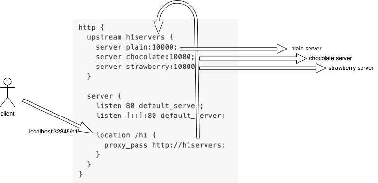

# Toast Masters

Become a toast master!


There are three kinds of toast machines, each for a different kind of toast.
| | Plain | Chocolate | Strawberry |
| ---------- | :----------------------------------------------: | :--------------------------------------------------: | :---------------------------------------------------: |
| |  |  |  |
| Service Id | 1 | 2 | 3 |

### Architecture


Note: Each kind of toast machine may possess different behaviors.

## Project Objectives

**Main objective: Practice applying horizontal scaling and load balancing strategies.**

Side effect: Become a toast master!

## Challenges

### Part 1 (Low Concurrency Test): Choose a Suitable Load Balancing Strategy

**Test description: 50 requests in total, with 9 requests at the same time at most.**

Each toast machine is limited to processing **3 toasts (requests) concurrently**, if you go over this number, then the toast machine will burn out and produce failures.

For this part, you will be restricted to **1 replica** of each kind of toast machine.

Please adjust the load balancing strategy through `nginx.conf` in order to successfully process all of the toasts without failures.



#### Examples

##### Round Robin (default)

Evenly dispatch to each server.

```
http {
  upstream h1servers {
    server plain:10000;
    server chocolate:10000;
    server strawberry:10000;
  }
  server {
    listen 80 default_server;
    listen [::]:80 default_server;
    location /h1 {
      proxy_pass http://h1servers;
    }
  }
}
```

##### Weighted Round Robin

e.g. for every 6(3+2+1) request,
plain will get 3, chocolate will get 2, strawberry will get the last one.

```
http {
  upstream h1servers {
    server plain:10000 weight=3;
    server chocolate:10000 weight=2;
    server strawberry:10000 weight=1;
  }
  server {
    listen 80 default_server;
    listen [::]:80 default_server;
    location /h1 {
      proxy_pass http://h1servers;
    }
  }
}
```

##### Least Connection

Choose the server that currently holds least connections.

```
http {
  upstream h1servers {
    least_conn;
    server plain:10000;
    server chocolate:10000;
    server strawberry:10000;
  }
  server {
    listen 80 default_server;
    listen [::]:80 default_server;
    location /h1 {
      proxy_pass http://h1servers;
    }
  }
}
```

Read more: https://nginx.org/en/docs/http/load_balancing.html

### Part 2 (High Concurrency Test): Experiment with Different Replica Settings

**Test description: 50 requests in total, with 50 requests at the same time at most.**

Process 50 toasts (requests) in the shortest amount of time with the least failure (failed requests).

You can adjust the load balancing strategy and number of replicas of each kind of toast machines freely.

[Click to see the leaderboard](https://airtable.com/shrWeznHPw24IlKcZ/tbllhRwtGFi3m1Dmx)

Score formula: Time taken to process 50 toasts (requests) + number of failures (failed requests as penalty)

The **lower** the score, the better you are!

## Getting Started

### 1. Clone this repository

```
git clone https://github.com/candy02058912/toastmasters.git
```

### 2. Test on local machine

**Prerequisites: Docker should be installed**

#### `scripts/deploy_swarm.sh`: For deploying the service

Usage

```
scripts/deploy_swarm.sh
```

#### `scripts/scale_swarm.sh`: For setting replicas for each service

Usage

```
scripts/scale_swarm.sh [-s <service id>] -r <number of replicas>
```

Example

```
# set service 1 to 1 replica and set service 2 to 2 replicas
srcipts/scale_swarm.sh -s 1 -s 2 -r 1 -r 2

# set all services to 3 replicas
scripts/scale_swarm.sh -r 3
```

#### `scripts/run.sh`: Run ApacheBench for load testing

Usage

```
# Test 1
scripts/run.sh -t 1

# Test 2
scripts/run.sh -t 2

# Test 1 & 2
scrupts/run.sh
```

The metrics you should take a look:
```
Time taken for tests:   56.109 seconds
...
Non-2xx responses:      49
```

#### Edit `src/nginx/nginx.conf`

Edit `src/nginx/nginx.conf` for adjusting load balancing strategies, please run `scripts/deploy_swarm.sh` when the file is changed, documentation: https://nginx.org/en/docs/http/load_balancing.html

### 4. Submit Project 
Files involved: `nginx.conf`, `scale.conf`

- Edit `nginx.conf` for your desired load balancing strategy

- Edit `scale.conf` with your desired number of replicas

- Open a Pull Request, documentation: https://docs.github.com/en/github/collaborating-with-issues-and-pull-requests/creating-a-pull-request

- Once submission finished successfully, you will receive a comment in your PR

#### Example

Low concurrency test: <table ><tr ><th colspan=2 bgcolor=white>Server Software:</th><td colspan=2 bgcolor=white>nginx/1.17.8</td></tr><tr ><th colspan=2 bgcolor=white>Server Hostname:</th><td colspan=2 bgcolor=white>nginx</td></tr><tr ><th colspan=2 bgcolor=white>Server Port:</th><td colspan=2 bgcolor=white>80</td></tr><tr ><th colspan=2 bgcolor=white>Document Path:</th><td colspan=2 bgcolor=white>/h1</td></tr><tr ><th colspan=2 bgcolor=white>Document Length:</th><td colspan=2 bgcolor=white>Variable</td></tr><tr ><th colspan=2 bgcolor=white>Concurrency Level:</th><td colspan=2 bgcolor=white>9</td></tr><tr ><th colspan=2 bgcolor=white>Time taken for tests:</th><td colspan=2 bgcolor=white>26.097 seconds</td></tr><tr ><th colspan=2 bgcolor=white>Complete requests:</th><td colspan=2 bgcolor=white>50</td></tr><tr ><th colspan=2 bgcolor=white>Failed requests:</th><td colspan=2 bgcolor=white>0</td></tr><tr ><th colspan=2 bgcolor=white>Non-2xx responses:</th><td colspan=2 bgcolor=white>34</td></tr><tr ><th colspan=2 bgcolor=white>Total transferred:</th><td colspan=2 bgcolor=white>13633 bytes</td></tr><tr ><th colspan=2 bgcolor=white>HTML transferred:</th><td colspan=2 bgcolor=white>6081 bytes</td></tr><tr ><th colspan=2 bgcolor=white>Requests per second:</th><td colspan=2 bgcolor=white>1.92</td></tr><tr ><th colspan=2 bgcolor=white>Transfer rate:</th><td colspan=2 bgcolor=white>0.51 kb/s received</td></tr><tr ><th bgcolor=white colspan=4>Connnection Times (ms)</th></tr><tr ><th bgcolor=white>&nbsp;</th> <th bgcolor=white>min</th>   <th bgcolor=white>avg</th>   <th bgcolor=white>max</th></tr><tr ><th bgcolor=white>Connect:</th><td bgcolor=white>    0</td><td bgcolor=white>    0</td><td bgcolor=white>    2</td></tr><tr ><th bgcolor=white>Processing:</th><td bgcolor=white>    0</td><td bgcolor=white> 2195</td><td bgcolor=white>12633</td></tr><tr ><th bgcolor=white>Total:</th><td bgcolor=white>    0</td><td bgcolor=white> 2195</td><td bgcolor=white>12635</td></tr></table>
High concurrency test: <table ><tr ><th colspan=2 bgcolor=white>Server Software:</th><td colspan=2 bgcolor=white>nginx/1.17.8</td></tr><tr ><th colspan=2 bgcolor=white>Server Hostname:</th><td colspan=2 bgcolor=white>nginx</td></tr><tr ><th colspan=2 bgcolor=white>Server Port:</th><td colspan=2 bgcolor=white>80</td></tr><tr ><th colspan=2 bgcolor=white>Document Path:</th><td colspan=2 bgcolor=white>/h1</td></tr><tr ><th colspan=2 bgcolor=white>Document Length:</th><td colspan=2 bgcolor=white>Variable</td></tr><tr ><th colspan=2 bgcolor=white>Concurrency Level:</th><td colspan=2 bgcolor=white>50</td></tr><tr ><th colspan=2 bgcolor=white>Time taken for tests:</th><td colspan=2 bgcolor=white>5.517 seconds</td></tr><tr ><th colspan=2 bgcolor=white>Complete requests:</th><td colspan=2 bgcolor=white>50</td></tr><tr ><th colspan=2 bgcolor=white>Failed requests:</th><td colspan=2 bgcolor=white>0</td></tr><tr ><th colspan=2 bgcolor=white>Non-2xx responses:</th><td colspan=2 bgcolor=white>47</td></tr><tr ><th colspan=2 bgcolor=white>Total transferred:</th><td colspan=2 bgcolor=white>15108 bytes</td></tr><tr ><th colspan=2 bgcolor=white>HTML transferred:</th><td colspan=2 bgcolor=white>7517 bytes</td></tr><tr ><th colspan=2 bgcolor=white>Requests per second:</th><td colspan=2 bgcolor=white>9.06</td></tr><tr ><th colspan=2 bgcolor=white>Transfer rate:</th><td colspan=2 bgcolor=white>2.67 kb/s received</td></tr><tr ><th bgcolor=white colspan=4>Connnection Times (ms)</th></tr><tr ><th bgcolor=white>&nbsp;</th> <th bgcolor=white>min</th>   <th bgcolor=white>avg</th>   <th bgcolor=white>max</th></tr><tr ><th bgcolor=white>Connect:</th><td bgcolor=white>    0</td><td bgcolor=white>    2</td><td bgcolor=white>    3</td></tr><tr ><th bgcolor=white>Processing:</th><td bgcolor=white>  447</td><td bgcolor=white>  771</td><td bgcolor=white> 3011</td></tr><tr ><th bgcolor=white>Total:</th><td bgcolor=white>  447</td><td bgcolor=white>  773</td><td bgcolor=white> 3014</td></tr></table>
