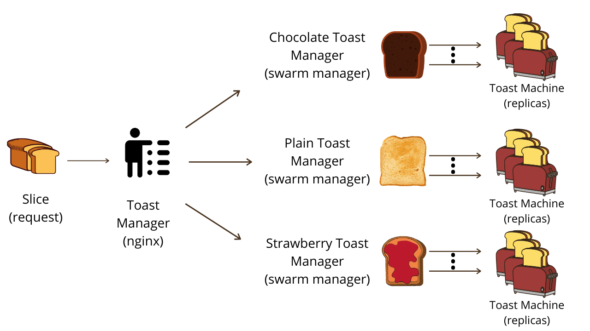

# Toast Masters

Become a toast master!


There are three kinds of toast machines, each for a different kind of toast.
| | Plain | Chocolate | Strawberry |
| ---------- | :----------------------------------------------: | :--------------------------------------------------: | :---------------------------------------------------: |
| |  |  |  |
| Service Id | 1 | 2 | 3 |

### Architecture



Note: Each kind of toast machine may possess different behaviors.

### Goal

Process 100 toasts (requests) in the shortest amount of time with the least burnt out toasts (failed requests).

[Click to see the leaderboard](https://airtable.com/shrWeznHPw24IlKcZ/tbllhRwtGFi3m1Dmx)

Score formula: Time taken to process 100 toasts (requests) + Burnt out toasts (failed requests as penalty)

The **lower** the score, the better you are!

## Project Objectives

**Main objective: Practice applying horizontal scaling and load balancing strategies.**

Side effect: Become a toast master!

## Getting Started

### 1. Clone this repository

```
git clone https://github.com/candy02058912/toastmasters.git
```

### 2. Test on local machine

**Prerequisites: Docker should be installed**

#### `scripts/deploy_swarm.sh`: For deploying the service

Usage

```
scripts/deploy_swarm.sh
```

#### `scripts/scale_swarm.sh`: For setting replicas for each service

Usage

```
scripts/scale_swarm.sh [-s <service id>] -r <number of replicas>
```

Example

```
# set service 1 to 1 replica and set service 2 to 2 replicas
srcipts/scale_swarm.sh -s 1 -s 2 -r 1 -r 2

# set all services to 3 replicas
scripts/scale_swarm.sh -r 3
```

#### `scripts/run.sh`: Run ApacheBench for load testing

Usage

```
# Verbose mode
scripts/run.sh -v
```

#### Edit `src/nginx/nginx.conf`

Edit `src/nginx/nginx.conf` for adjusting load balancing strategies, please run `scripts/deploy_swarm.sh` when the file is changed, documentation: https://nginx.org/en/docs/http/load_balancing.html

### 4. Submit Project

- Edit `scale.conf` with your desired number of replicas, this will be used during submission

- Open a Pull Request, documentation: https://docs.github.com/en/github/collaborating-with-issues-and-pull-requests/creating-a-pull-request

- Once submission finished successfully, you will receive a comment in your PR

Example

<table ><tr ><th colspan=2 bgcolor=white>Server Software:</th><td colspan=2 bgcolor=white>nginx/1.17.8</td></tr><tr ><th colspan=2 bgcolor=white>Server Hostname:</th><td colspan=2 bgcolor=white>nginx</td></tr><tr ><th colspan=2 bgcolor=white>Server Port:</th><td colspan=2 bgcolor=white>80</td></tr><tr ><th colspan=2 bgcolor=white>Document Path:</th><td colspan=2 bgcolor=white>/h1?a=1&b=3</td></tr><tr ><th colspan=2 bgcolor=white>Document Length:</th><td colspan=2 bgcolor=white>37 bytes</td></tr><tr ><th colspan=2 bgcolor=white>Concurrency Level:</th><td colspan=2 bgcolor=white>100</td></tr><tr ><th colspan=2 bgcolor=white>Time taken for tests:</th><td colspan=2 bgcolor=white>73.527 seconds</td></tr><tr ><th colspan=2 bgcolor=white>Complete requests:</th><td colspan=2 bgcolor=white>100</td></tr><tr ><th colspan=2 bgcolor=white>Failed requests:</th><td colspan=2 bgcolor=white>10</td></tr><tr ><td colspan=4 bgcolor=white >   (Connect: 0, Length: 10, Exceptions: 0)</td></tr><tr ><th colspan=2 bgcolor=white>Non-2xx responses:</th><td colspan=2 bgcolor=white>9</td></tr><tr ><th colspan=2 bgcolor=white>Total transferred:</th><td colspan=2 bgcolor=white>19521 bytes</td></tr><tr ><th colspan=2 bgcolor=white>HTML transferred:</th><td colspan=2 bgcolor=white>4743 bytes</td></tr><tr ><th colspan=2 bgcolor=white>Requests per second:</th><td colspan=2 bgcolor=white>1.36</td></tr><tr ><th colspan=2 bgcolor=white>Transfer rate:</th><td colspan=2 bgcolor=white>0.26 kb/s received</td></tr><tr ><th bgcolor=white colspan=4>Connnection Times (ms)</th></tr><tr ><th bgcolor=white>&nbsp;</th> <th bgcolor=white>min</th>   <th bgcolor=white>avg</th>   <th bgcolor=white>max</th></tr><tr ><th bgcolor=white>Connect:</th><td bgcolor=white>    0</td><td bgcolor=white>    7</td><td bgcolor=white>   13</td></tr><tr ><th bgcolor=white>Processing:</th><td bgcolor=white>  507</td><td bgcolor=white>22516</td><td bgcolor=white>72509</td></tr><tr ><th bgcolor=white>Total:</th><td bgcolor=white>  507</td><td bgcolor=white>22523</td><td bgcolor=white>72522</td></tr></table>

## Files to be edited for submission:

- `src/nginx/nginx.conf`
- `scale.conf`
